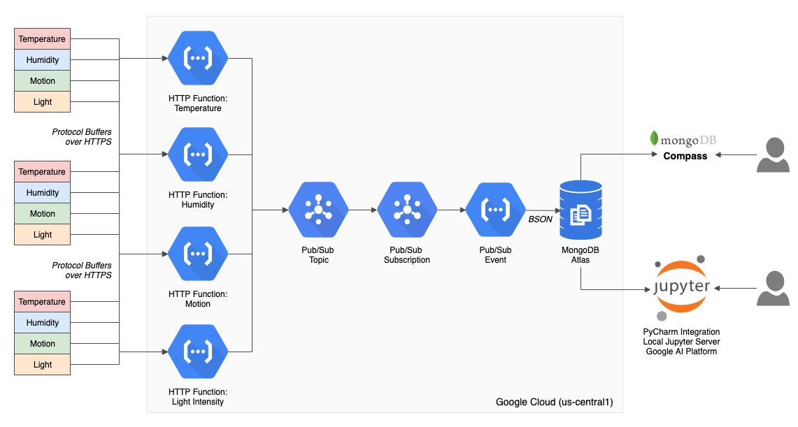

# IoT Data Analytics with Protocol Buffers, Google Cloud Functions, and MongoDB Atlas
Project files for demonstration detailed in the article, [IoT Telemetry Collection using Google Protocol Buffers, Cloud Functions, Cloud Pub/Sub, and MongoDB Atlas](https://programmaticponderings.com/)

Collect IoT telemetry using Google Protocol Buffers’ serialized binary format over HTTPS, serverless Google Cloud Functions, and Google Cloud Pub/Sub, as an alternative solution to leading Cloud IoT/IIoT platforms and the MQTT protocol. Store sensor data as NoSQL documents in a MongoDB Atlas cluster on GCP. Aggregate, analyze, and build machine learning models with the data using tools such as MongoDB Compass, Jupyter Notebooks, and Google’s AI Platform Notebooks.

